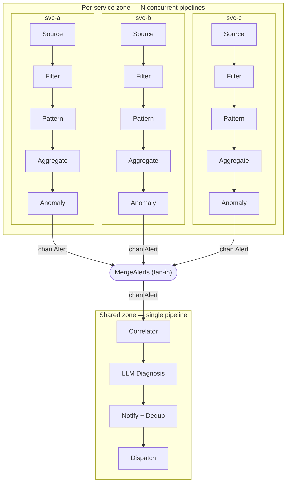
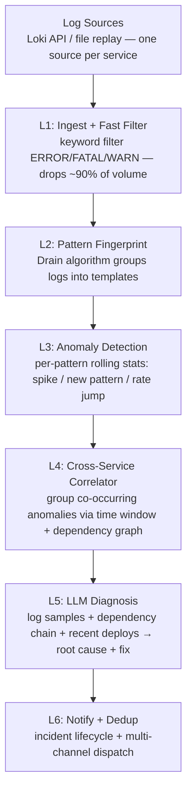
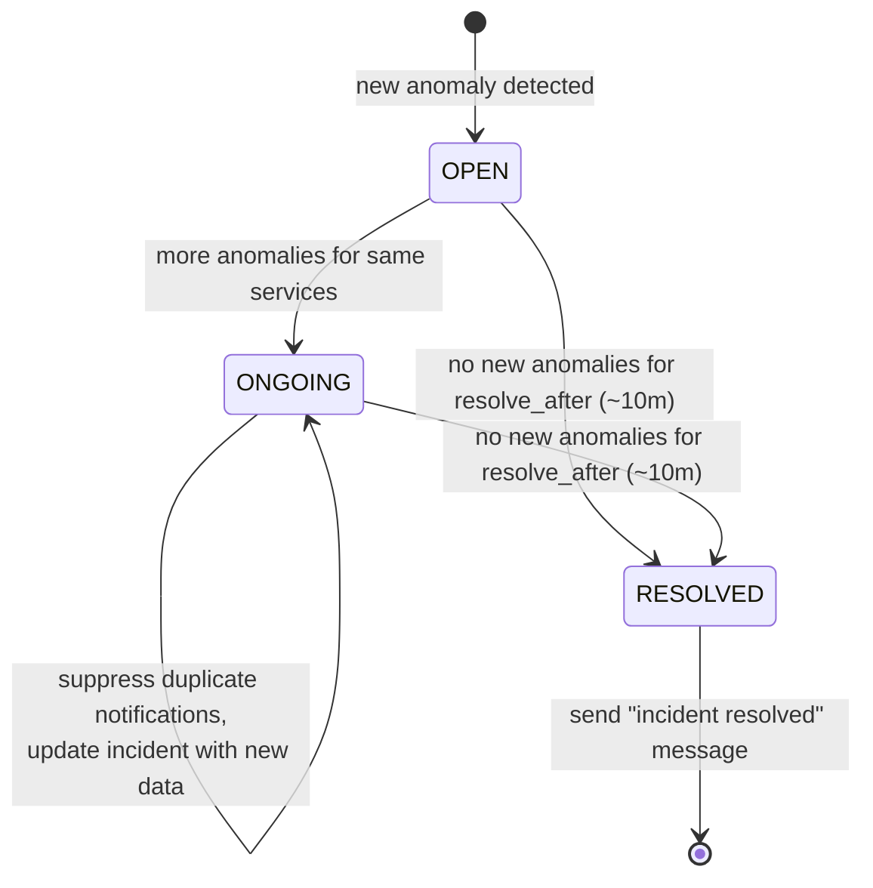

# Log Analysis Agent — Design Document

**Project**: Intelligent Log Monitor for Microservices  
**Author**: David Zhang  
**Date**: April 9, 2026  
**Status**: Phases 1-6 implemented  

---

## 1. Problem Statement

Our company runs a microservice architecture. When things go wrong, engineers
manually dig through logs from multiple services, try to figure out which
service is the root cause, and guess at fixes. This is slow, error-prone,
and doesn't scale.

**Key pain points:**
- No centralized alerting configured for many services
- Errors cascade across services — hard to find the root cause
- Same types of incidents repeat, but lessons aren't reused
- On-call engineers waste time reading thousands of duplicate log lines

## 2. What This Agent Does

A Go program that continuously monitors logs from all services, detects
anomalies, correlates errors across services, and uses an LLM to diagnose
root causes and suggest fixes.

**In one sentence:** "Service B's database is down (deployed v2.3.1 five
minutes ago), causing timeouts in Service A and Service C. Recommend:
rollback Service B to v2.3.0."

## 3. Architecture Overview

The agent runs an **independent pipeline per service** for the per-service
stages (L1–L3), then **fans in** to shared cross-service stages (L4–L6):



Per-service pipeline detail — the layer flow, repeated once per service for
L1–L3 and shared from L4 onward:



### Concurrency Model

Every stage is a channel-based goroutine (`Run(ctx, in) -> out`). Concurrency
comes from two places:

1. **Per-service fan-out (L1–L3).** For each entry in `services:`, the agent
   spins up a full `Source → Filter → Pattern → Aggregate → Anomaly` chain.
   These pipelines run fully in parallel and share no state:
   - each service has its **own Drain tree** (no lock contention, no
     cross-service pattern bleed),
   - its **own aggregation window timer**, and
   - its **own anomaly baseline store**.
   A slow or failing source for one service never blocks the others.

2. **Pipeline parallelism.** Within a pipeline, each stage runs concurrently
   with its neighbors, bounded by channel buffer sizes — while the Aggregator
   summarizes window *N*, the Filter is already processing window *N+1*.

**Fan-in.** `notify.MergeAlerts` merges the N per-service `Alert` channels into
one before the Correlator. This is the single synchronization point between the
two zones. It merges low-volume `Alert`s (a few per window), not raw log lines,
so the merge is cheap. Ordering across services is not guaranteed; the
Correlator regroups by time window, so interleaving is expected.

**Why L4–L6 are single instances.** The Correlator must observe *all* services
to group co-occurring anomalies via the dependency graph; the Diagnoser and
Lifecycle manager operate on whole incidents that may span services. These are
inherently global and stay singular.

**Trade-off.** Memory grows linearly with service count (N Drain trees + N
baseline stores), bounded per service by `pattern.max_patterns`. For a few
dozen services this is negligible; the win is real CPU parallelism for the
Drain-heavy path and failure isolation between services.

## 4. Layer-by-Layer Design

### L1: Ingest + Fast Filter

**Purpose:** Connect to log sources and drop non-error logs immediately.

**Input:** Raw log streams from all services.  
**Output:** Only ERROR / FATAL / WARN log lines (plus a few lines of context).

**Design decisions:**
- Support multiple log sources via an interface:
  ```go
  type LogSource interface {
      // Stream returns a channel of log lines. Each source instance targets
      // exactly one service (via its Loki query or file path); the service
      // name is stamped onto every LogLine it emits.
      Stream(ctx context.Context) (<-chan LogLine, error)
  }
  ```
- Implementations: `LokiSource` (query Loki HTTP API), `FileSource` (replay an
  NDJSON file). `KafkaSource` is a future addition. Start with Loki since we
  already use it.
- **One source instance per service.** The agent builds an independent pipeline
  for every entry in the `services:` config list, so each service is polled and
  processed concurrently (see §3, Concurrency Model).
- Fast filter is just string matching: skip lines that don't contain
  `ERROR`, `FATAL`, `WARN`, or `panic`.
- Each `LogLine` carries metadata:
  ```go
  type LogLine struct {
      Service         string
      Timestamp       time.Time
      Level           string    // ERROR, FATAL, WARN, or "" if unknown
      Raw             string    // original log text
      PatternID       string    // set by L2 (Pattern Fingerprint)
      PatternTemplate string    // human-readable template (set alongside PatternID)
  }
  ```

### L2: Pattern Fingerprint (Drain Algorithm)

**Purpose:** Group identical log patterns together so we count *kinds* of
errors, not individual lines.

**Input:** Filtered log lines from L1.  
**Output:** Pattern objects with counts.

**Why not regex?** Hand-written regex is fragile and breaks as services evolve.
Drain auto-discovers templates from the log stream.

**How Drain works:**
1. Tokenize the log by spaces.
2. Navigate a fixed-depth tree: level 1 = token count, level 2 = first token,
   level 3 = second token.
3. At the leaf, compare against existing templates by token-level similarity.
4. If similarity ≥ threshold (0.5), merge (replace differing tokens with `<*>`).
5. If no match, create a new template.

**Pre-processing:** Before Drain, apply regex to replace obvious variables:
- IP addresses → `<IP>`
- UUIDs → `<UUID>`
- Numbers → `<NUM>`
- File paths with IDs → normalize the ID parts

**Data structure:**
```go
type LogPattern struct {
    Signature    string    // templatized log, e.g. "connection timeout to <*>:<*>"
    Service      string
    Level        string
    FirstSeen    time.Time
    LastSeen     time.Time
    CountMinute  int       // count in current 1-min window
    Count5Min    int       // count in current 5-min window
    SampleLines  []string  // keep last 5 raw log lines as examples
}
```

**Drain parameters:**
| Parameter | Value | Rationale |
|---|---|---|
| `depth` | 4 | Good balance of speed vs. accuracy |
| `similarityThreshold` | 0.5 | Standard default, tune per service if needed |
| `maxChildren` | 100 | Prevent memory blowup from high-cardinality tokens |

### L3: Anomaly Detection

**Purpose:** Decide which patterns are "abnormal" and worth escalating.

**Input:** Pattern objects with counts from L2.  
**Output:** Anomaly events.

**Three trigger conditions:**

| Trigger | Logic | Why It Matters |
|---|---|---|
| **Spike** | Current count > mean + 3σ (rolling baseline) | A known error suddenly happens 100x more |
| **New pattern** | Template never seen in the last 24h | New bug or new failure mode — often the most dangerous |
| **Error rate jump** | Service-level error rate crosses threshold | Even if individual patterns are low, the aggregate is bad |

**Rolling baseline:**
- Maintain per-pattern stats: mean and standard deviation over a 24-hour
  sliding window, bucketed into 1-minute intervals.
- Held **in-memory** today (baselines rebuild from the live stream after a
  restart). Persisting them to a snapshot file or embedded DB (e.g. BadgerDB
  or SQLite) to survive restarts is future work — see §5, Memory footprint.
- Time-of-day awareness: keep separate baselines for each hour of the day
  (traffic at 3am ≠ traffic at 3pm).

```go
type PatternStats struct {
    PatternID   string
    HourOfDay   int       // 0-23, separate baseline per hour
    Buckets     []int     // last 60 one-minute counts (circular buffer)
    Mean        float64
    StdDev      float64
}

func (s *PatternStats) IsSpike(currentCount int) bool {
    return float64(currentCount) > s.Mean + 3*s.StdDev
}
```

### L4: Cross-Service Correlator

**Purpose:** Group anomalies from multiple services that are part of the
same incident. This is what turns isolated alerts into root-cause analysis.

**Input:** Anomaly events from L3.  
**Output:** Incident objects containing correlated anomalies.

**How it works:**
1. **Time window:** Anomalies from different services that fire within a
   2-minute window are candidates for correlation.
2. **Dependency graph lookup:** Check if the affected services are connected
   in the dependency graph.
3. **Grouping:** If Service A depends on Service B and both have anomalies
   in the same window, group them into one incident.

**Dependency graph:**
- Start with a static YAML config file (see below).
- Later: auto-discover from OpenTelemetry traces.

```yaml
# config/dependencies.yaml
services:
  order-service:
    calls: [payment-service, inventory-service, notification-service]
  payment-service:
    calls: [bank-gateway, fraud-detection]
  inventory-service:
    calls: [warehouse-db]
  notification-service:
    calls: [email-provider, sms-provider]
```

**Incident structure:**
```go
type Incident struct {
    ID           string
    Status       string           // OPEN, ONGOING, RESOLVED
    Severity     string           // P1, P2, P3 (assigned by LLM)
    OpenedAt     time.Time
    LastUpdated  time.Time
    Services     []string         // all affected services
    RootService  string           // suspected root cause (deepest in dependency chain)
    Anomalies    []AnomalyEvent   // all correlated anomalies
    Diagnosis    string           // LLM output
    Suggestions  []string         // LLM fix suggestions
}
```

**Root cause heuristic:** Among correlated services, the one **deepest** in
the dependency chain (fewest dependents) is likely the root cause. Errors
cascade *upstream*: if B depends on C and both error, C is more likely the
root cause.

### L5: LLM Diagnosis

**Purpose:** Given an incident with log samples from multiple services,
produce a human-readable diagnosis and actionable fix suggestions.

**Input:** Incident object from L4.  
**Output:** Diagnosis text + severity + fix suggestions.

**Prompt structure:**
```
You are an SRE assistant diagnosing a production incident.

INCIDENT CONTEXT:
- Time: 2026-04-09 14:32 - 14:35 UTC
- Affected services: order-service, payment-service, bank-gateway
- Dependency chain: order-service → payment-service → bank-gateway
- Suspected root cause: bank-gateway (deepest in chain)

RECENT DEPLOYMENTS:
- bank-gateway v2.3.1 deployed at 14:30 (2 minutes before incident)

LOG PATTERNS (per service):

[bank-gateway] — 0 logs arriving (service appears DOWN)

[payment-service] — 200 errors/min (baseline: 0)
  Pattern: "connection refused to <*>:443" (200x)
  Samples:
    "connection refused to bank-gw-prod-1:443, request_id=abc123"
    "connection refused to bank-gw-prod-2:443, request_id=def456"

[order-service] — 50 errors/min (baseline: 2)
  Pattern: "timeout calling payment-service: context deadline exceeded" (50x)
  Samples:
    "timeout calling payment-service: context deadline exceeded after 5s"

SIMILAR PAST INCIDENTS:
- 2025-09-08: Database migration ran against production, caused 4h outage.
  Root cause was misconfigured $DB_HOST environment variable.

Based on the above, provide:
1. ROOT CAUSE: What is actually broken and why?
2. SEVERITY: P1 (customer-facing outage), P2 (degraded), or P3 (minor)
3. IMMEDIATE ACTION: What should the on-call engineer do right now?
4. FOLLOW-UP: What should be done after the incident is resolved?
```

**Context enrichment sources:**

| Source | How to Get It | Value |
|---|---|---|
| Dependency graph | Static YAML config | "A calls B calls C" — root cause reasoning |
| Recent deploys | Query deploy API / CD tool | Most outages happen right after deploys |
| Log samples | Stored in L2 (SampleLines) | Concrete evidence for the LLM |
| Past incidents | RAG over incident post-mortems | "This looks like last month's outage" |

**RAG for past incidents:**
- Maintain a knowledge base of past incident post-mortems (markdown files).
- Use the same RAG pipeline from research_agent (embed + store in vector DB).
- When a new incident fires, search for similar past incidents and include
  the top 2-3 in the prompt.

**LLM choice:** DeepSeek via litellm (same as other agents). Use
`temperature=0` for deterministic diagnosis.

**Cost control:** The entire funnel (L1-L4) exists to ensure we only call
the LLM for genuine incidents. Expected: ~5-20 LLM calls per day, not per
minute.

### L6: Notification + Deduplication

**Purpose:** Deliver the diagnosis to the right people, without alert fatigue.

**Incident lifecycle:**


**Notification channels are pluggable via a `Notifier` interface:**

```go
// Notifier is the interface all notification channels implement.
// Adding a new channel (Teams, email, SMS, etc.) means implementing
// this interface — no changes to the rest of the pipeline.
type Notifier interface {
    // Send delivers a notification for the given incident.
    // The implementation formats the message for its channel.
    Send(ctx context.Context, incident Incident) error

    // Name returns the channel name (for logging/config).
    Name() string
}
```

**Built-in implementations:**

| Implementation | Channel | Use Case |
|---|---|---|
| `SlackNotifier` | Slack webhook | Team channels, default |
| `TeamsNotifier` | Microsoft Teams webhook | Teams-based orgs |
| `EmailNotifier` | SMTP / SendGrid | Stakeholder summaries |
| `SMSNotifier` | Twilio / SNS | P1 on-call escalation |
| `PagerDutyNotifier` | PagerDuty Events API | On-call paging |
| `WebhookNotifier` | Generic HTTP POST | Custom integrations |
| `LogNotifier` | Stdout/file | Local dev / testing |

Multiple notifiers can be active simultaneously. Severity routing
determines which channels fire for each severity level:

**Severity routing (configured in `config.yaml`):**

```yaml
notification:
  channels:
    - type: slack
      webhook_url: "https://hooks.slack.com/..."
      severities: [P1, P2, P3]          # all incidents
      channel_map:
        P1: "#incidents"
        P2: "#incidents"
        P3: "#service-health"
    - type: pagerduty
      routing_key: "..."
      severities: [P1]                   # only pages for P1
    - type: email
      smtp_host: "smtp.company.com"
      recipients: ["oncall@company.com"]
      severities: [P1, P2]              # email for P1+P2
    - type: teams
      webhook_url: "https://outlook.office.com/webhook/..."
      severities: [P1, P2, P3]
```

**Notification format example:**
```
🔴 P1 INCIDENT — bank-gateway DOWN

Root cause: bank-gateway stopped responding after v2.3.1 deploy
  at 14:30. payment-service and order-service are cascading.

Immediate action: Rollback bank-gateway to v2.3.0

Affected: bank-gateway, payment-service, order-service
Duration: 3 min (ongoing)
Similar past incident: Q3 2025 outage (config error after deploy)
```

Each `Notifier` implementation adapts this content to its channel's
format (Slack blocks, Teams adaptive cards, HTML email, plain text SMS).

## 5. Performance Considerations

The design is built around one idea: **do expensive work as rarely as
possible.** Each layer is a filter that shrinks the data before it reaches the
next, so the costly stages (LLM diagnosis, notification) only ever see a
handful of items.

### The funnel

| Stage | Input rate (typical) | What it cuts | Output rate |
|---|---|---|---|
| L1 Filter | full log firehose | keyword filter drops non-error lines | ~10% of input |
| L2 Pattern | error lines | Drain collapses many lines into few templates | few patterns / window |
| L3 Anomaly | per-pattern window counts | forwards only anomalous windows | rare alerts |
| L4 Correlator | per-service alerts | groups co-occurring alerts | few incidents |
| L5 LLM | incidents | (no reduction — the target) | ~5–20 calls/day |

By the time the expensive LLM call is reached, the stream has been reduced by
several orders of magnitude. This is what keeps the running cost near zero.

### Hot path: the Drain parser

L2 is the highest-volume stage (it sees every error line), so it is the one
that matters for CPU. Drain is deliberately cheap:

- **Fixed-depth parse tree** (`Depth = 4`) — classification is `O(depth)` tree
  descent plus a bounded token comparison, with no regex backtracking and no
  training phase.
- **`MaxChildren = 100`** caps fan-out per tree node so a pathological
  high-cardinality token can't explode the tree.
- **`MaxPatterns = 10000`** with LRU eviction bounds total pattern memory; the
  oldest template is evicted once the cap is hit.

### Concurrency and throughput

- **Per-service fan-out (L1–L3)** turns the Drain-heavy path into real CPU
  parallelism: N services → N independent pipelines, each with its own Drain
  tree, window timer, and baseline store (no locks, no cross-service
  contention). See §3, Concurrency Model.
- **Pipeline overlap** — bounded channel buffers (sized to `cap(in)`) let each
  stage work on window *N+1* while its downstream neighbor is still handling
  window *N*.
- **Cheap fan-in** — `MergeAlerts` merges low-volume `Alert`s (a few per
  window), never raw log lines, so the single synchronization point between the
  two zones is negligible.

### Memory footprint

- Everything is **in-memory**; there is no database on the hot path.
- Memory grows **linearly with service count**: N Drain trees + N baseline
  stores, each Drain tree bounded by `MaxPatterns` and each baseline a small
  fixed-size struct per pattern. For a few dozen services this is a few tens of
  MB.
- **No persistence** — baselines rebuild from the live stream after a restart,
  trading a short warm-up for operational simplicity.

### External calls and blocking

- **Loki polling** is pull-based on a configurable `poll_interval`; this bounds
  both source pressure and Loki API load. Too-frequent polling risks API rate
  limits, so it is a deliberate knob rather than a busy loop.
- **LLM diagnosis (L5)** is a synchronous HTTP call inside the pipeline with a
  **30 s client timeout**. Because it sits behind the whole funnel it is reached
  only for genuine incidents, and failures degrade gracefully (heuristic
  fallback, `slog.Warn`) instead of stalling the pipeline.
- **Backpressure** is natural: bounded channels slow upstream stages when a
  downstream stage lags, and `ctx` cancellation propagates from the source to
  unwind every goroutine cleanly.

### Tuning knobs

| Knob | Effect | Trade-off |
|---|---|---|
| `source.loki.poll_interval` | how often each source polls Loki | freshness vs. API load |
| aggregation window | L2/L3 batching granularity | detection latency vs. noise |
| `correlator.window` (default 2 min) | how long alerts are buffered for grouping | incident completeness vs. latency |
| `pattern.max_patterns` / `depth` | Drain memory and specificity | accuracy vs. footprint |
| anomaly thresholds (σ / multiplier) | how eagerly alerts fire | sensitivity vs. false positives |
| dedup window / `resolve_after` | notification chattiness | signal vs. alert fatigue |
| `diagnosis.timeout` | LLM call budget | reliability vs. tail latency |

## 6. Project Structure

```
log_agent/
├── DESIGN.md                          ← this file
├── README.md                          ← quick-start guide
├── PHASE{1..5}_DESIGN.md              ← per-phase design docs
├── PHASE{1..5}_TEST_PLAN.md           ← per-phase test plans
├── docs/
│   └── phase6-notify-dedup-*.md       ← Phase 6 design & test plan
├── config/
│   ├── config.yaml                    ← default Loki config (per-service list)
│   ├── config-file.yaml               ← local file-source testing
│   ├── config-demo.yaml               ← per-service fan-out/fan-in demo
│   ├── config-correlator.yaml         ← correlator demo
│   ├── config-diagnosis.yaml          ← diagnosis demo (DeepSeek)
│   ├── config-email.yaml              ← email notification demo (Gmail SMTP)
│   └── dependencies.yaml              ← service dependency graph
├── cmd/
│   └── agent/
│       └── main.go                    ← entry point, config, pipeline wiring
├── internal/
│   ├── ingest/
│   │   ├── source.go                  ← LogLine struct, LogSource interface
│   │   ├── loki.go                    ← Loki API polling source
│   │   ├── file.go                    ← NDJSON file replay source
│   │   ├── filter.go                  ← ParseLevel, level-aware filter
│   │   └── *_test.go
│   ├── pattern/
│   │   ├── drain.go                   ← Drain algorithm (prefix tree)
│   │   ├── preprocess.go              ← regex normalization (IP, UUID, NUM)
│   │   ├── engine.go                  ← PatternEngine pipeline stage
│   │   └── *_test.go
│   ├── anomaly/
│   │   ├── detector.go                ← spike / new-pattern / rate-jump
│   │   ├── baseline.go                ← EMA rolling baseline (mean, stddev)
│   │   ├── store.go                   ← in-memory baseline store
│   │   └── *_test.go
│   ├── correlator/
│   │   ├── correlator.go              ← time-window cross-service grouping
│   │   ├── depgraph.go                ← YAML dependency graph loader
│   │   ├── wrap.go                    ← WrapAlerts bypass (no correlator)
│   │   └── *_test.go
│   ├── diagnosis/
│   │   ├── diagnoser.go               ← Diagnoser pipeline stage
│   │   ├── llm.go                     ← HTTP LLM client (DeepSeek API)
│   │   ├── prompt.go                  ← prompt assembly
│   │   ├── parse.go                   ← LLM response parser
│   │   └── *_test.go
│   ├── notify/
│   │   ├── notifier.go                ← Notifier interface, Dispatcher, severity routing
│   │   ├── incident.go                ← Incident struct, status types, ID generation
│   │   ├── lifecycle.go               ← LifecycleManager (OPEN→ONGOING→RESOLVED, dedup)
│   │   ├── aggregator.go              ← time-window alert aggregation
│   │   ├── merge.go                   ← MergeAlerts fan-in of per-service pipelines
│   │   ├── slack.go                   ← Slack Block Kit webhook
│   │   ├── teams.go                   ← Microsoft Teams Adaptive Card webhook
│   │   ├── email.go                   ← SMTP email (HTML template)
│   │   ├── log.go                     ← slog-based stdout notifier
│   │   └── *_test.go
│   └── testutil/
│       ├── fake_clock.go              ← deterministic time for tests
│       ├── fake_loki.go               ← httptest-based fake Loki
│       └── mock_notifier.go           ← mock notifier for pipeline tests
├── testdata/
│   ├── sample_logs.ndjson             ← demo log data (single-service)
│   ├── correlator_demo.ndjson         ← demo log data (multi-service cascade)
│   ├── mock_llm_server.go            ← local mock LLM for testing
│   └── mock_smtp_server.go           ← local mock SMTP for testing
└── go.mod
```

## 7. Phased Roadmap

### Phase 1: Error Catcher ✅

**Goal:** Get value immediately — a program that tails logs and sends error
notifications to any configured channel.

**Built:**
- `internal/ingest/` — Loki polling source + file replay source, level-aware filter
- `internal/notify/notifier.go` — `Notifier` interface + Dispatcher (concurrent fan-out)
- `internal/notify/slack.go` — Slack Block Kit webhook
- `internal/notify/log.go` — slog-based stdout notifier
- `internal/notify/aggregator.go` — time-window alert aggregation
- `cmd/agent/main.go` — YAML config loading, pipeline wiring, graceful shutdown

### Phase 2: Pattern Grouping ✅

**Goal:** Stop Slack spam. Group identical errors into patterns.

**Built:**
- `internal/pattern/drain.go` — Drain algorithm (prefix tree + similarity matching)
- `internal/pattern/preprocess.go` — regex normalization (IP, UUID, numbers)
- `internal/pattern/engine.go` — PatternEngine pipeline stage

### Phase 3: Anomaly Detection ✅

**Goal:** Only alert on *meaningful* changes, not constant background noise.

**Built:**
- `internal/anomaly/detector.go` — spike, new-pattern, rate-jump detection
- `internal/anomaly/baseline.go` — EMA rolling baseline (mean + stddev)
- `internal/anomaly/store.go` — in-memory baseline store (per-service, per-pattern)

### Phase 4: Cross-Service Correlation ✅

**Goal:** Stop treating cascading failures as separate incidents.

**Built:**
- `internal/correlator/correlator.go` — time-window grouping + dependency graph lookup
- `internal/correlator/depgraph.go` — YAML dependency graph loader + root-cause heuristic
- `internal/correlator/wrap.go` — WrapAlerts bypass for uncorrelated mode
- `config/dependencies.yaml` — service dependency graph

### Phase 5: LLM Diagnosis ✅

**Goal:** Tell engineers *what's wrong and how to fix it*, not just *what happened*.

**Built:**
- `internal/diagnosis/diagnoser.go` — Diagnoser pipeline stage (concurrent LLM calls)
- `internal/diagnosis/llm.go` — HTTP LLM client (DeepSeek API compatible)
- `internal/diagnosis/prompt.go` — prompt assembly (incident context → structured prompt)
- `internal/diagnosis/parse.go` — LLM response parser (extracts severity, diagnosis, suggestions)

### Phase 6: Notification + Lifecycle Management ✅

**Goal:** Deliver diagnosis to the right people with incident lifecycle (dedup, auto-resolve).

**Built:**
- `internal/notify/lifecycle.go` — LifecycleManager: OPEN→ONGOING→RESOLVED state machine,
  dedup window, auto-resolve timer
- `internal/notify/email.go` — SMTP email notifier (HTML template, severity-colored headers)
- `internal/notify/teams.go` — Microsoft Teams webhook (Adaptive Card format)
- `internal/notify/notifier.go` — severity routing via `NotifierRoute` + `NewRoutedDispatcher`
- `internal/notify/incident.go` — `IncidentStatus`, `EventType`, `Duration` fields
- Updated Slack + Log notifiers with event-type-aware formatting

### Future: RAG Over Past Incidents

**Goal:** Learn from history. "This looks like the outage from last month."

**Plan:**
- `internal/diagnosis/rag.go` — embed + search incident post-mortems
- `incidents/` directory — historical post-mortem collection

**Value:** Institutional knowledge is automatically surfaced during incidents.

## 8. Key Design Decisions

| Decision | Choice | Rationale |
|---|---|---|
| Language | Go | Same as our services. Fast, low memory, good concurrency. |
| Log parsing | Drain algorithm | Industry standard, no training needed, handles evolving log formats. |
| Anomaly detection | Rolling mean + 3σ | Simple, interpretable, per-pattern baselines. |
| LLM | DeepSeek via litellm | Cheap, good at structured reasoning. |
| Dependency graph | Static YAML (phase 1), traces later | Get value immediately, improve accuracy later. |
| Persistence | In-memory (baselines) | Lightweight; baselines rebuild on restart. |
| Notification | Pluggable `Notifier` interface | Slack, Teams, Email, Log implemented. Add SMS/PagerDuty by implementing the interface. |

## 9. Cost Estimate

| Component | Cost |
|---|---|
| Log processing (L1-L4) | $0 — runs on one small VM/pod |
| LLM calls (L5) | ~$0.50-2/day — only called for genuine incidents (~5-20/day, small prompts) |
| Storage (baselines) | Negligible — in-memory only (no persistence today) |

The entire funnel exists to ensure L5 (the expensive LLM call) is invoked
as rarely as possible.

## 10. Future Enhancements

- **Auto-remediation:** For known incident types, automatically trigger
  runbooks (e.g., rollback, restart, scale up).
- **Trace integration:** Auto-discover dependency graph from OpenTelemetry.
- **Dashboard:** Web UI showing live patterns, anomalies, and incidents.
- **Feedback loop:** Engineers rate diagnoses (helpful/not helpful) to
  improve prompts over time.
- **Multi-cluster:** Support monitoring across multiple k8s clusters / regions.
