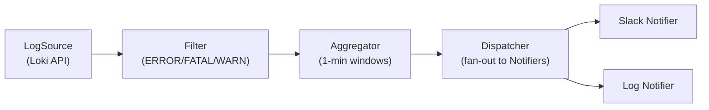

# Phase 1: Error Catcher — Detailed Design

**Goal:** A Go program that tails logs from Loki, filters for errors, and
sends notifications to any configured channel (starting with Slack + stdout).

**Timeline:** Week 1-2  
**Value delivered:** Engineers get notified of errors faster — no AI needed yet.

> **📎 Historical design record — Phase 1.** This document reflects the pipeline
> *as designed at this phase*. The current system runs **one pipeline per
> service** (fan-out) that fans in via `MergeAlerts` before the shared
> cross-service stages (L4–L6). See [DESIGN.md](DESIGN.md) § "Concurrency Model"
> for the current topology; the single-source diagrams below are point-in-time.

---

## 1. Component Overview



Three packages to build: `ingest`, `notify`, and the `main` wiring.

---

## 2. Package: `internal/ingest`

### 2.1 Types

```go
// source.go

// LogLine is a single log entry with metadata.
type LogLine struct {
    Service   string
    Timestamp time.Time
    Level     string // ERROR, FATAL, WARN, or "" if unknown
    Raw       string // original log text
}

// LogSource streams log lines from an external system.
type LogSource interface {
    // Stream returns a channel that emits log lines.
    // The channel is closed when ctx is cancelled or an unrecoverable
    // error occurs. Transient errors (network blips) are retried internally.
    Stream(ctx context.Context) (<-chan LogLine, error)
}
```

### 2.2 `LokiSource` implementation

```go
// loki.go

type LokiSource struct {
    BaseURL      string        // e.g. "http://loki.internal:3100"
    Query        string        // LogQL query, e.g. `{namespace="prod"}`
    PollInterval time.Duration // how often to query, default 10s
    Client       *http.Client
}
```

**How it works:**
1. On `Stream()`, start a goroutine that polls Loki's
   `GET /loki/api/v1/query_range` every `PollInterval`.
2. Use Loki's `start` parameter (exclusive) to avoid re-fetching.
   After each successful poll, set `start` to `max(timestamps) + 1ns`.
   Initialize to `time.Now()` on first run (only look forward).
   This is safe because Loki timestamps have nanosecond precision and
   the `start` boundary is exclusive in `query_range` with `direction=forward`.
3. Parse the Loki JSON response, extract `stream` labels (service name)
   and `values` (timestamp + log line).
4. Send each log line to the output channel.

**Retry policy:** On HTTP error or timeout, log a warning and retry after
`PollInterval`. On 3 consecutive failures, log an error (but keep retrying).
Never crash — the agent must stay up.

**LogQL query:** The base query comes from config. For Phase 1 we use a
simple label selector like `{namespace="prod"}` without server-side
content filtering. We avoid `|~ "ERROR|FATAL|WARN"` because it matches
keywords anywhere in the log line (e.g. a DEBUG log whose message body
contains "ERROR:") — this would give us the same false positives we're
trying to avoid. All filtering is done client-side by `ParseLevel`, which
understands structured log formats. The tradeoff is higher network transfer;
if this becomes a problem, we can add Loki label-based filtering (e.g.
`{namespace="prod", level=~"error|fatal|warn"}`) if services set the
`level` label, or accept the bandwidth cost since the agent runs in the
same cluster as Loki.

**Why poll instead of WebSocket/tail?** Loki's tail API uses WebSockets
which are harder to manage (reconnect logic, proxy issues). Polling every
10s is simpler, reliable, and the 10s latency is acceptable for alerting.

### 2.3 `Filter`

```go
// filter.go

// ErrorLevels are the log levels we care about.
var ErrorLevels = []string{"ERROR", "FATAL", "WARN", "panic"}

// Filter returns a new channel that only emits log lines matching
// error-level keywords. It calls ParseLevel on each line and sets
// the Level field before emitting. Lines with Level="" are dropped.
func Filter(ctx context.Context, in <-chan LogLine) <-chan LogLine

// ParseLevel extracts the level from a raw log line.
// Tries structured (JSON `level` field) first, falls back to keyword scan.
// Returns normalized uppercase: "ERROR", "FATAL", "WARN", or "" if not an error.
func ParseLevel(raw string) string
```

**Pre-processing:** Before level detection, strip ANSI escape codes
(e.g. `\x1b[31m`) from the raw line. Some tools inject color codes that
wrap keywords like `\x1b[31mERROR:\x1b[0m`, which would confuse parsing.
Use a simple regex: `\x1b\[[0-9;]*m` → `""`.

**Level detection strategy (in order):**
1. **JSON logs:** Try to unmarshal as JSON. Look for keys: `level`, `severity`,
   `log_level`. If a key is found, normalize its value (case-insensitive):
   `error` → `ERROR`, `fatal` → `FATAL`, `warn`/`warning` → `WARN`.
   If the value is a non-error level (`info`, `debug`, `trace`), return `""`
   **immediately** — do NOT fall through to keyword scan.
2. **Key-value format:** Match `level=<value>` (with or without quotes).
   Same normalization and **same early-return rule**: `level=debug` → `""`
   immediately, even if the message body contains "ERROR".
3. **Bracket format:** Match `[ERROR]`, `[WARN]`, `[FATAL]`, `[INFO]`,
   `[DEBUG]`. Same rule: recognized non-error brackets → return `""`.
4. **Keyword scan (last resort):** Only reached when steps 1-3 found **no
   structured level field at all**. Search for `ERROR`, `FATAL`, `WARN`,
   `panic` as whole words. This catches truly unstructured logs.

**Critical rule: structured level is authoritative.** If any of steps 1-3
finds a level field, that level is the final answer. We never fall through
to keyword scan on the message body. This prevents false positives like:
- `level=debug msg="...ERROR: process exited..."` → `""` (debug, drop)
- `{"level":"info","msg":"...severity:high...Error_account..."}` → `""` (info, drop)

Lines that don't match any level are dropped silently.

---

## 3. Package: `internal/notify`

### 3.1 Notifier Interface

```go
// notifier.go

// Alert is the data we send to notification channels.
// In Phase 1, this is a simple error summary.
// Later phases will enrich this with patterns, incidents, and LLM diagnosis.
type Alert struct {
    Service     string
    Level       string      // highest severity seen
    Count       int         // number of error lines in the window
    Window      time.Duration // aggregation window (e.g. 1 minute)
    SampleLines []string    // up to 5 example log lines
    Timestamp   time.Time   // window end time
}

type Notifier interface {
    Send(ctx context.Context, alert Alert) error
    Name() string
}
```

### 3.2 Dispatcher

```go
// notifier.go (continued)

// Dispatcher fans out alerts to all registered notifiers.
type Dispatcher struct {
    notifiers []Notifier
}

func NewDispatcher(notifiers ...Notifier) *Dispatcher

// Dispatch sends the alert to all notifiers concurrently.
// Logs errors from individual notifiers but does not fail the pipeline.
func (d *Dispatcher) Dispatch(ctx context.Context, alert Alert) error
```

**Behavior:**
- Fan-out: sends to all notifiers in parallel using `errgroup`.
- If one notifier fails (e.g. Slack webhook down), log the error but
  still deliver via the other channels.
- Timeout: each notifier gets 10s to send. Exceed → log + skip.

### 3.3 Aggregator (Prevents Spam)

Without aggregation we'd fire one notification **per log line** — unusable.

```go
// aggregator.go

// Aggregator batches log lines per service into time windows and
// emits a single Alert per service per window.
type Aggregator struct {
    Window   time.Duration  // default 1 minute
    MinCount int            // minimum errors to trigger an alert (default 1)
}

// Run consumes filtered log lines and emits Alerts.
func (a *Aggregator) Run(ctx context.Context, in <-chan ingest.LogLine) <-chan Alert
```

**How it works:**
1. Maintain a `map[string]*bucket` keyed by service name.
2. Each bucket collects: count, highest severity, up to 5 sample lines.
3. Every `Window` duration, flush all non-empty buckets as `Alert` objects.
4. Reset buckets after flush.

### 3.4 `SlackNotifier`

```go
// slack.go

type SlackNotifier struct {
    WebhookURL string
    Client     *http.Client
}
```

Formats the `Alert` as a Slack Block Kit message and POSTs to the webhook.

**Message format:**
```
🔴 ERROR — payment-service (47 errors in last 1m)

Samples:
• connection refused to bank-gw-prod-1:443, request_id=abc
• connection refused to bank-gw-prod-2:443, request_id=def
• connection refused to bank-gw-prod-3:443, request_id=ghi
```

### 3.5 `LogNotifier`

```go
// log.go

type LogNotifier struct {
    Logger *slog.Logger
}
```

Writes alerts to stdout/file via `slog`. Used for local development and
as a guaranteed-delivery fallback (stdout never fails).

---

## 4. Package: `cmd/agent`

### 4.1 `main.go` — Wiring

```go
func main() {
    cfg := loadConfig("config/config.yaml")

    // Build the source
    source := ingest.NewLokiSource(cfg.Loki)

    // Build notifiers from config
    notifiers := buildNotifiers(cfg.Notification)
    dispatcher := notify.NewDispatcher(notifiers...)

    // Build aggregator
    aggregator := notify.NewAggregator(cfg.Window, cfg.MinCount)

    // Wire pipeline
    ctx, cancel := signal.NotifyContext(context.Background(), os.Interrupt, syscall.SIGTERM)
    defer cancel()

    logCh, err := source.Stream(ctx)
    // handle err...

    filtered := ingest.Filter(ctx, logCh)
    alerts := aggregator.Run(ctx, filtered)

    for alert := range alerts {
        if err := dispatcher.Dispatch(ctx, alert); err != nil {
            slog.Error("dispatch failed", "err", err)
        }
    }
}
```

### 4.2 Config

```yaml
# config/config.yaml
loki:
  url: "http://loki.internal:3100"
  query: '{namespace="prod"}'
  poll_interval: 10s

aggregation:
  window: 1m
  min_count: 1     # alert even on 1 error (tune later)

notification:
  channels:
    - type: slack
      webhook_url: "${SLACK_WEBHOOK_URL}"  # from env
    - type: log                            # always-on stdout fallback
```

Webhook URLs come from environment variables, not checked into source.

**Environment variable expansion:** Go's YAML parsers don't natively expand
`${VAR}` syntax. After loading the YAML, call `os.ExpandEnv()` on string
fields that may contain env var references. Alternatively, use a library
like `github.com/caarlos0/env` for struct-level env binding.

### 4.3 Graceful Shutdown

On `SIGINT`/`SIGTERM`:
1. Cancel the context → `LokiSource.Stream` stops polling.
2. The filtered channel drains remaining buffered lines.
3. Aggregator flushes any partial window immediately.
4. Dispatcher sends final alerts, then exits.

---

## 5. Error Handling & Resilience

| Failure | Behavior |
|---|---|
| Loki unreachable | Retry every `poll_interval`. Log warning. Keep agent running. |
| Loki returns partial data | Process what we got. Next poll picks up where we left off (high-water mark). |
| Slack webhook fails | Log error. Other notifiers still fire. Alert is not retried (acceptable in Phase 1; Phase 3 adds persistence). |
| Malformed log line | Skip it, log at debug level. Never crash on bad input. |
| Agent OOM | Bounded channels (buffer 10,000). LokiSource uses `select` with `default` to detect a full channel — when the buffer is full, new lines are dropped and a warning counter is incremented (logged every 10s). This is a lossy-on-overflow design; acceptable because Loki retains the logs and a human can query them if needed. |

---

## 6. Files to Create

```
log_agent/
├── go.mod
├── go.sum
├── config/
│   └── config.yaml
├── cmd/
│   └── agent/
│       └── main.go
└── internal/
    ├── ingest/
    │   ├── source.go       ← LogLine type + LogSource interface
    │   ├── loki.go         ← LokiSource implementation
    │   └── filter.go       ← Filter func + ParseLevel
    └── notify/
        ├── notifier.go     ← Alert type + Notifier interface + Dispatcher
        ├── aggregator.go   ← time-window batching
        ├── slack.go        ← SlackNotifier
        └── log.go          ← LogNotifier (stdout)
```

---

## 7. Testing Strategy

### 7.1 Unit Tests

Each component is tested in isolation with no external dependencies.

#### `ingest/filter_test.go` — Level Parsing + Filtering

```go
func TestParseLevel(t *testing.T) {
    tests := []struct {
        name  string
        raw   string
        want  string
    }{
        // JSON structured logs
        {"json error",   `{"level":"error","msg":"db timeout"}`,    "ERROR"},
        {"json fatal",   `{"severity":"FATAL","msg":"oom killed"}`, "FATAL"},
        {"json info",    `{"level":"info","msg":"started"}`,        ""},

        // Bracket format: [ERROR], [WARN]
        {"bracket error", `2026-04-09 [ERROR] connection refused`,  "ERROR"},
        {"bracket warn",  `2026-04-09 [WARN] slow query 3.2s`,     "WARN"},

        // Key-value format: level=error
        {"kv error",  `ts=2026-04-09 level=error msg="timeout"`,   "ERROR"},

        // Keyword fallback
        {"keyword panic", `goroutine 1 [running]: panic: nil pointer`, "FATAL"},
        {"keyword error", `ERROR - failed to connect to redis`,     "ERROR"},

        // No match
        {"info line",  `2026-04-09 INFO request completed 200`,    ""},
        {"plain text", `all systems operational`,                   ""},
    }
    // ...subtests with t.Run
}

func TestFilter_DropsNonErrors(t *testing.T) {
    // Feed a channel with mixed log lines.
    // Assert only ERROR/FATAL/WARN lines come out.
}

func TestFilter_ContextCancellation(t *testing.T) {
    // Cancel context mid-stream.
    // Assert output channel closes without hanging.
}
```

#### `ingest/loki_test.go` — Loki Response Parsing

```go
func TestLokiSource_ParseResponse(t *testing.T) {
    // Feed a sample Loki JSON response (captured from real Loki).
    // Assert correct LogLine extraction: service, timestamp, raw text.
}

func TestLokiSource_HighWaterMark(t *testing.T) {
    // Two consecutive poll responses with overlapping timestamps.
    // Assert no duplicate log lines are emitted.
}
```

#### `notify/aggregator_test.go` — Window Batching

```go
func TestAggregator_BatchesByService(t *testing.T) {
    // Send 10 errors from service-a, 5 from service-b in one window.
    // Assert: 2 alerts, service-a.Count=10, service-b.Count=5.
}

func TestAggregator_WindowFlush(t *testing.T) {
    // Send errors, advance time past window boundary.
    // Assert alert is emitted after the window.
}

func TestAggregator_SampleLines_MaxFive(t *testing.T) {
    // Send 20 errors from same service.
    // Assert alert.SampleLines has exactly 5 entries.
}

func TestAggregator_MinCount(t *testing.T) {
    // Set MinCount=5. Send 3 errors.
    // Assert no alert is emitted.
}

func TestAggregator_FlushOnShutdown(t *testing.T) {
    // Cancel context with a partial window.
    // Assert the partial window is flushed as a final alert.
}
```

#### `notify/dispatcher_test.go` — Fan-out

```go
func TestDispatcher_FansOutToAll(t *testing.T) {
    // Register 3 mock notifiers.
    // Dispatch one alert.
    // Assert all 3 received the alert.
}

func TestDispatcher_OneFailureDoesNotBlockOthers(t *testing.T) {
    // Register 2 notifiers: one returns error, one succeeds.
    // Assert the successful one still receives the alert.
}

func TestDispatcher_Timeout(t *testing.T) {
    // Register a notifier that blocks for 30s.
    // Assert dispatch completes within ~10s (timeout).
}
```

#### `notify/slack_test.go` — Slack Formatting

```go
func TestSlackNotifier_MessageFormat(t *testing.T) {
    // Create an alert, call Send() with an httptest.Server capturing the request.
    // Assert the JSON body is valid Slack Block Kit format.
    // Assert it contains the service name, count, and sample lines.
}

func TestSlackNotifier_HTTPError(t *testing.T) {
    // httptest.Server returns 500.
    // Assert Send() returns an error (not a panic).
}
```

### 7.2 Integration Test with Fake Loki

Build a fake Loki HTTP server that serves canned responses. This tests
the full pipeline end-to-end without needing a real Loki instance.

```go
// integration_test.go (build tag: //go:build integration)

func TestPipeline_EndToEnd(t *testing.T) {
    // 1. Start a fake Loki server (httptest.Server) that serves
    //    a canned query_range response with mixed log levels.
    fakeLoki := httptest.NewServer(http.HandlerFunc(func(w http.ResponseWriter, r *http.Request) {
        // Return a Loki-format JSON with 10 ERROR, 5 INFO, 2 FATAL lines
        json.NewEncoder(w).Encode(cannedLokiResponse)
    }))
    defer fakeLoki.Close()

    // 2. Wire the pipeline: LokiSource → Filter → Aggregator → Dispatcher
    source := ingest.NewLokiSource(ingest.LokiConfig{
        URL:          fakeLoki.URL,
        Query:        `{namespace="prod"}`,
        PollInterval: 100 * time.Millisecond,  // fast for tests
    })

    var received []notify.Alert
    var mu sync.Mutex
    mockNotifier := &MockNotifier{
        SendFunc: func(ctx context.Context, a notify.Alert) error {
            mu.Lock()
            received = append(received, a)
            mu.Unlock()
            return nil
        },
    }

    dispatcher := notify.NewDispatcher(mockNotifier)
    aggregator := notify.NewAggregator(500*time.Millisecond, 1) // 500ms window

    ctx, cancel := context.WithTimeout(context.Background(), 3*time.Second)
    defer cancel()

    logCh, _ := source.Stream(ctx)
    filtered := ingest.Filter(ctx, logCh)
    alerts := aggregator.Run(ctx, filtered)

    for a := range alerts {
        dispatcher.Dispatch(ctx, a)
    }

    // 3. Assert
    mu.Lock()
    defer mu.Unlock()
    // Should have alerts only for ERROR/FATAL lines, no INFO lines.
    assert.Greater(t, len(received), 0)
    for _, a := range received {
        assert.NotEqual(t, "INFO", a.Level)
        assert.Greater(t, a.Count, 0)
        assert.LessOrEqual(t, len(a.SampleLines), 5)
    }
}
```

### 7.3 Manual Smoke Test (against real Loki)

For developers who have access to a Loki instance:

```bash
# 1. Build the agent
cd log_agent && go build -o agent ./cmd/agent/

# 2. Run with log notifier only (no Slack needed)
LOKI_URL=http://localhost:3100 ./agent --config config/config.yaml

# 3. Generate test errors in a monitored service
# In another terminal, make your test service emit error logs:
curl http://localhost:8080/debug/error   # trigger a test error endpoint

# 4. Observe stdout — you should see alerts within ~1 minute
# Expected output:
# 2026-04-09T14:32:00Z ALERT service=payment-service level=ERROR count=3 window=1m0s
#   sample: "connection refused to bank-gw:443"
#   sample: "connection refused to bank-gw:443"
#   sample: "timeout after 5s"
```

### 7.4 Slack Integration Test (manual, one-time)

```bash
# Set a real webhook (use a test channel like #bot-testing)
export SLACK_WEBHOOK_URL="https://hooks.slack.com/services/T.../B.../xxx"

# Run agent with Slack enabled
./agent --config config/config.yaml

# Trigger errors → verify message appears in #bot-testing
```

### 7.5 Testing Patterns Summary

| Layer | Test Type | External Deps | Run Frequency |
|---|---|---|---|
| `ParseLevel` | Unit (table-driven) | None | Every commit (`go test ./...`) |
| `Filter` | Unit (channel-based) | None | Every commit |
| `Aggregator` | Unit (time-controlled) | None | Every commit |
| `Dispatcher` | Unit (mock notifiers) | None | Every commit |
| `SlackNotifier` | Unit (httptest server) | None | Every commit |
| Full pipeline | Integration (fake Loki) | None | Every commit (build tag) |
| Real Loki | Manual smoke test | Loki instance | Before release |
| Slack delivery | Manual | Slack workspace | Once during setup |

### 7.6 Key Testing Principles

1. **No real HTTP calls in CI.** Use `httptest.Server` for Loki and Slack.
2. **Control time.** The aggregator should accept a `clock` interface
   (or use `time.Ticker` that can be replaced in tests) so we can test
   window boundaries without sleeping.
3. **Channel semantics matter.** Every test that uses channels must verify:
   - Output channel closes after input is exhausted or ctx is cancelled.
   - No goroutine leaks (use `goleak` or `t.Cleanup` checks).
4. **Table-driven tests** for `ParseLevel` — this is the function most
   likely to need expanding as we encounter new log formats.

---

## 8. What Phase 1 Does NOT Include

- No Drain algorithm (Phase 2) — alerts show raw sample lines, not patterns.
- No anomaly detection (Phase 3) — every error window triggers an alert.
- No LLM (Phase 4) — alerts are descriptive, not diagnostic.
- No cross-service correlation (Phase 5) — each service alerts independently.
- No persistence — if the agent restarts, it starts fresh.

These are intentional. Phase 1 delivers a **working, useful tool** in 2
weeks. Each subsequent phase adds intelligence on top of this foundation.
