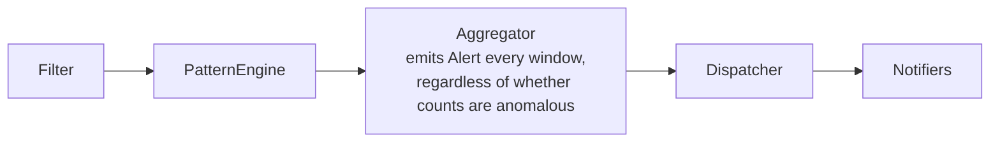
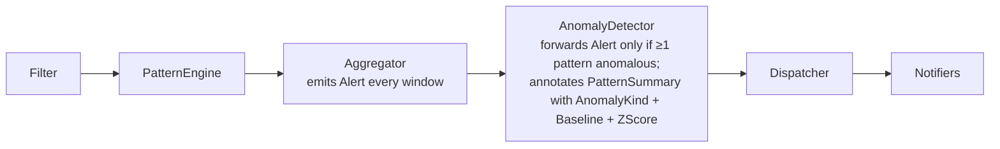

# Phase 3: Anomaly Detection — Detailed Design

**Goal:** Filter the stream of per-pattern window counts so that the agent
only notifies when something is genuinely unusual. Without this layer, every
1-minute window that contains errors fires an alert — including steady-state
noise like `notifications-processor` emitting 32 identical errors every
minute, all day long. With L3, we only alert when behaviour changes.

**Prerequisite:** Phase 2 (Pattern Fingerprint) — completed.

> **📎 Historical design record — Phase 3.** This document reflects the pipeline
> *as designed at this phase*. The current system runs **one pipeline per
> service** (fan-out) that fans in via `MergeAlerts` before the shared
> cross-service stages (L4–L6). See [DESIGN.md](DESIGN.md) § "Concurrency Model"
> for the current topology; the single-source diagrams below are point-in-time.

---

## 1. Problem With Alerting Without L3

After Phase 2, the pipeline emits one `Alert` per service per aggregation
window, with per-pattern counts. But "this service has errors" is not an
actionable signal. "This service just started having 10× more of a pattern
it has never produced before" is.

**What we need to suppress:**
- Steady-state recurring errors (known flap, tracked Jira ticket, no urgency)
- Expected traffic-correlated increases during peak hours

**What we need to surface:**
- A pattern that has never appeared before (new bug, new crash path)
- A known pattern whose count suddenly spikes (upstream failure, overload)
- A steady but very low-rate pattern that suddenly goes to 50× its average

---

## 2. Pipeline Change

### Before (Phase 2)



### After (Phase 3)



`AnomalyDetector` runs as a channel pipeline stage:

```go
func (d *AnomalyDetector) Run(ctx context.Context, in <-chan notify.Alert) <-chan notify.Alert
```

---

## 3. Three Trigger Conditions

| Trigger | Logic | Rationale |
|---|---|---|
| **NewPattern** | PatternID not seen in the last `new_pattern_grace` duration | New crash path or new bug is often the highest-urgency signal |
| **Spike** | `count > mean + spike_multiplier × stddev` AND min samples met | Known error suddenly happens N× more — upstream failure, overload |
| **RateJump** | `count > rate_jump_factor × mean` | Guards low-base-rate patterns: mean=2, count=20 may not exceed 3σ but is clearly abnormal |

**Priority when multiple triggers apply to the same pattern:**
`NewPattern > Spike > RateJump`. Only the highest is recorded; all are logged.

**Alert forwarding rule:** an `Alert` is forwarded downstream only if **at
least one** `PatternSummary` has `Anomaly != AnomalyNone`. Patterns with
`AnomalyNone` are still included in the forwarded alert (for context), but
the alert-level `Level` and `Count` reflect all patterns, not just anomalous
ones.

---

## 4. Package: `internal/anomaly`

New package. Three files:

```
internal/anomaly/
    baseline.go   — PatternBaseline type, EMA stats, trigger logic
    store.go      — BaselineStore interface + MemoryStore
    detector.go   — AnomalyDetector channel stage
```

---

## 5. Baseline Algorithm

### 5.1 Exponentially Weighted Mean and Variance (EMA)

We use an online EMA estimator because:
- **O(1)** per observation — no buffer to maintain
- **Fixed memory** per pattern regardless of history length
- **Recency bias** — recent counts matter more than ancient history
- Naturally handles patterns that fluctuate in rate

**Update rule** (Welford-EMA hybrid, numerically stable):

```
On each new count observation c:

  if n == 0:          ← first observation
    mean = c
    variance = 0
    n = 1
  else:
    delta  = c - mean
    mean   = mean + α × delta
    variance = (1-α) × (variance + α × delta²)
    n += 1

  stddev = sqrt(variance)
```

Where `α` is the EMA decay factor (config: `ema_alpha`, default `0.3`).

**Intuition for α=0.3:** The effective lookback is roughly `1/α ≈ 3 windows`.
A sudden spike takes ~2-3 windows to significantly shift the mean. This
means a single-window blip may not corrupt the baseline permanently.

### 5.2 Why Not Welford's Cumulative Average?

Welford's classical algorithm computes the **true** running mean over all
observations but never forgets. If a pattern emitted 100 errors/min for the
first 6 hours and then calmed to 5/min, the mean would stay elevated for
hours. EMA adapts in ~3-5 windows, which matches our urgency requirements.

### 5.3 Spike Threshold

```
IsSpike(count) = count > mean + spike_multiplier × stddev
              AND n >= min_samples
```

**Min samples guard:** Until we have seen at least `min_samples` windows, we
do not fire Spike alerts. This prevents false positives on the first few
windows after agent startup when EMA hasn't converged yet.

**ZScore** (stored on PatternSummary for notifiers to render):

```
ZScore = (count - mean) / max(stddev, 1.0)
```

Floor stddev at 1.0 to avoid division by zero when the pattern has been
perfectly steady.

### 5.4 Rate Jump Threshold

```
IsRateJump(count) = count > rate_jump_factor × mean
                 AND mean > 0
                 AND n >= min_samples
```

This catches low-base-rate patterns where stddev inflates slowly. Example:
a pattern that averages 2/min has stddev ≈ 1.5; it would need count=7 to be
a spike (mean + 3σ). But going from 2/min to 20/min (`rate_jump_factor=5`)
is clearly unusual and should be flagged.

### 5.5 New Pattern Detection

A pattern is "new" if `time.Since(lastSeen) > new_pattern_grace`. This
means:
- Patterns seen for the first time ever → `lastSeen` is the zero `time.Time`,
  so `time.Since(zero) ≈ 56 years > 24h` → always flagged New.
- Patterns that haven't appeared in 24h reappear → `lastSeen` is stale,
  so the check triggers again. This catches recurring but infrequent bugs.

`lastSeen` is updated on **every** window in `evaluate` (step 9 below),
after all classification has been done. The update happens even for
non-anomalous windows, so the field always reflects the most recent
window where the pattern was observed.

**Why `LastSeen` and not `FirstSeen`?**  
`FirstSeen` (set once, never updated) can only detect patterns younger
than the grace period — it cannot detect patterns that disappeared and
reappeared. `LastSeen` (updated every window) enables both cases with a
single field and a single condition.

### 5.6 Known Limitations (Future Work)

- **No time-of-day awareness.** A pattern that fires 50/min during business
  hours and 0/min at night will cause false Spike alerts when traffic resumes
  in the morning. Fix: maintain separate `PatternBaseline` per hour-of-day
  (24 EMA instances per pattern). Deferred to Phase 3.5.
- **In-memory store only.** Agent restart loses all baselines → brief burst
  of false NewPattern alerts on restart. Fix: SQLite persistence (Phase 4).
- **No per-service tuning.** `spike_multiplier`, `min_samples`, etc. are
  global. Future: per-service or per-pattern overrides in config.

---

## 6. Types

### 6.1 AnomalyKind (in `internal/notify`)

Defined in the `notify` package to avoid an import cycle: the `anomaly`
package imports `notify.Alert` (to read and annotate it), so `AnomalyKind`
cannot live in `anomaly`.

```go
// notifier.go — additions

// AnomalyKind classifies what triggered an anomaly, or AnomalyNone.
type AnomalyKind int

const (
    AnomalyNone       AnomalyKind = iota // 0 — steady state, not anomalous
    AnomalyNewPattern                    // first time this pattern has been seen
    AnomalySpike                         // count > mean + N×stddev
    AnomalyRateJump                      // count > N× mean
)

func (k AnomalyKind) String() string
```

### 6.2 PatternSummary — add Anomaly fields

```go
// notifier.go — PatternSummary extended

type PatternSummary struct {
    Template    string
    Count       int
    Level       string
    SampleLines []string

    // Set by AnomalyDetector. Zero values when detector is disabled.
    Anomaly  AnomalyKind // what triggered the alert (AnomalyNone = not anomalous)
    Baseline float64     // EMA mean at the time of detection
    ZScore   float64     // (Count - mean) / stddev; 0 when stddev unknown
}
```

`Alert` struct itself is **unchanged** — the anomaly information lives inside
`PatternSummary`, so no protocol or interface changes are needed.

### 6.3 PatternBaseline (in `internal/anomaly`)

```go
// baseline.go

// PatternBaseline holds the EMA statistics for a single pattern.
// It is updated once per aggregation window.
type PatternBaseline struct {
    N        int         // number of observations seen so far
    Mean     float64     // EMA mean
    Variance float64     // EMA variance
    LastSeen time.Time   // last window this pattern was observed (zero = never seen)
}

// Update incorporates a new window count into the EMA.
func (b *PatternBaseline) Update(count int, alpha float64)

// Stddev returns sqrt(Variance), floored at 0.
func (b *PatternBaseline) Stddev() float64

// IsNewPattern returns true if this pattern has not been seen recently.
// A zero LastSeen (never observed) always returns true.
// A stale LastSeen (> grace ago) returns true — pattern reappeared after absence.
func (b *PatternBaseline) IsNewPattern(grace time.Duration, now time.Time) bool

// IsSpike returns true if count exceeds the spike threshold.
// Returns false if fewer than minSamples have been observed.
func (b *PatternBaseline) IsSpike(count int, multiplier float64, minSamples int) bool

// IsRateJump returns true if count exceeds rate_jump_factor × mean.
// Returns false if fewer than minSamples have been observed or mean == 0.
func (b *PatternBaseline) IsRateJump(count int, factor float64, minSamples int) bool

// ZScore returns (count - mean) / max(stddev, 1.0).
func (b *PatternBaseline) ZScore(count int) float64
```

### 6.4 BaselineStore (in `internal/anomaly`)

```go
// store.go

// BaselineStore is the persistence interface for pattern baselines.
// Implementations: MemoryStore (Phase 3), SQLiteStore (Phase 4).
type BaselineStore interface {
    // Get returns the baseline for a pattern, and whether one exists.
    Get(patternID string) (PatternBaseline, bool)
    // Set persists (or upserts) a pattern baseline.
    Set(patternID string, b PatternBaseline)
}

// MemoryStore is an in-memory BaselineStore. Not safe for concurrent use —
// the AnomalyDetector serializes all access through a single goroutine.
type MemoryStore struct {
    baselines map[string]PatternBaseline
}

func NewMemoryStore() *MemoryStore
func (s *MemoryStore) Get(patternID string) (PatternBaseline, bool)
func (s *MemoryStore) Set(patternID string, b PatternBaseline)
```

### 6.5 AnomalyDetector (in `internal/anomaly`)

```go
// detector.go

type AnomalyConfig struct {
    SpikeMultiplier float64       // default: 3.0
    RateJumpFactor  float64       // default: 5.0
    EMAAlpha        float64       // default: 0.3
    MinSamples      int           // default: 5
    NewPatternGrace time.Duration // default: 24h
}

// setDefaults fills zero-value fields with safe production defaults.
// Called by NewAnomalyDetector. A zero SpikeMultiplier would fire on
// every window; a zero EMAAlpha would freeze the mean at first observation.
func (c *AnomalyConfig) setDefaults()

type AnomalyDetector struct {
    config AnomalyConfig
    store  BaselineStore
    Clock  notify.Clock // exported so tests can inject a fake (mirrors Aggregator.Clock)
}

func NewAnomalyDetector(cfg AnomalyConfig, store BaselineStore) *AnomalyDetector

// Run consumes Alerts from the Aggregator, annotates each PatternSummary
// with anomaly fields, updates baselines, and forwards only alerts where
// at least one pattern is anomalous.
//
// Thread safety: single goroutine, no mutex needed.
// The output channel is closed when ctx is done or in is closed.
func (d *AnomalyDetector) Run(ctx context.Context, in <-chan notify.Alert) <-chan notify.Alert

// No separate Clock interface: AnomalyDetector.Clock is typed as notify.Clock.
// Since anomaly already imports notify (for notify.Alert), there is no import
// cycle. Copying the interface would create a gratuitous divergence point.
```

**Internal `evaluate` method:**

```go
// evaluate annotates all PatternSummary entries in the alert and
// returns (annotated alert, hasAnomaly bool).
func (d *AnomalyDetector) evaluate(alert notify.Alert) (notify.Alert, bool)
```

For each `PatternSummary` in `alert.Patterns`:
1. `now := d.Clock.Now()`; look up baseline in the store.
2. If not found: create a new `PatternBaseline{}` (zero LastSeen → IsNewPattern fires).
3. **Snapshot** pre-update values: `preMean = baseline.Mean`, `preStddev = baseline.Stddev()`.
4. Classify (using pre-update stats — baseline has not been touched yet):
   a. If `baseline.IsNewPattern(grace, now)`: kind = `AnomalyNewPattern`.
   b. Else if `baseline.IsSpike(count, multiplier, minSamples)`: kind = `AnomalySpike`.
   c. Else if `baseline.IsRateJump(count, factor, minSamples)`: kind = `AnomalyRateJump`.
   d. Else: kind = `AnomalyNone`.
5. Set `ps.Anomaly = kind`.
6. Set `ps.Baseline = preMean` (pre-update; reflects historical baseline).
7. Set `ps.ZScore = (count - preMean) / max(preStddev, 1.0)` (pre-update).
8. `baseline.Update(count, alpha)` — shifts mean/variance toward current count.
9. `baseline.LastSeen = now` — mark the pattern as recently seen.
10. `store.Set(patternID, baseline)` — persist updated baseline.

**Why snapshot before Update (steps 3→7 before step 8)?**  
The reported `Baseline` and `ZScore` must reflect the *historical* state that
classified the anomaly. If we reported post-update values, a count=200 into a
mean=32 baseline would shift the mean to ~32+50=82 before we report it, making
the alert say "baseline=82" instead of the true "baseline=32" the operator needs.

For alerts with empty `Patterns` (pattern engine disabled / Phase 1 mode):
forward as-is (do not suppress). L3 has no PatternID to look up, so it cannot
make a baseline-driven decision; pass-through is the safe default.

---

## 7. Changes to Existing Code

### 7.1 `internal/notify/notifier.go`

- Add `AnomalyKind` type + constants + `String()` method.
- Add `Anomaly`, `Baseline`, `ZScore` fields to `PatternSummary`.
- No changes to `Alert`, `Notifier`, `Dispatcher`.

### 7.2 `internal/notify/log.go`

Render anomaly kind in the per-pattern line:

```
[28x ERROR SPIKE z=4.2] EventSubtypes.UpdateStatus fail HandleUpdateEventSubtypeCRD <*>
[6x ERROR NEW] EventSubtypes.Update fail: <*> is invalid
```

When `Anomaly == AnomalyNone`, omit the tag (print `[28x ERROR]` as before).

### 7.3 `internal/notify/slack.go`

- Prepend an emoji badge to anomalous patterns:
  - `AnomalyNewPattern` → 🆕 `:new:`
  - `AnomalySpike` → 📈 `:chart_with_upward_trend:`
  - `AnomalyRateJump` → ⚡ `:zap:`
- Include z-score when available: `[28x +4.2σ]`

### 7.4 `cmd/agent/main.go`

```go
alerts := aggregator.Run(ctx, enriched)

var anomalous <-chan notify.Alert
if cfg.Anomaly.Enabled {
    detector := anomaly.NewAnomalyDetector(anomaly.AnomalyConfig{
        SpikeMultiplier: cfg.Anomaly.SpikeMultiplier,
        RateJumpFactor:  cfg.Anomaly.RateJumpFactor,
        EMAAlpha:        cfg.Anomaly.EMAAlpha,
        MinSamples:      cfg.Anomaly.MinSamples,
        NewPatternGrace: cfg.Anomaly.NewPatternGrace,
    }, anomaly.NewMemoryStore())
    anomalous = detector.Run(ctx, alerts)
    slog.Info("anomaly detector enabled",
        "spike_multiplier", cfg.Anomaly.SpikeMultiplier,
        "ema_alpha", cfg.Anomaly.EMAAlpha,
    )
} else {
    anomalous = alerts
}

for alert := range anomalous {
    if err := dispatcher.Dispatch(ctx, alert); err != nil {
        slog.Error("dispatch failed", "err", err)
    }
}
```

### 7.5 `config/config.yaml`

```yaml
anomaly:
  enabled: true
  spike_multiplier: 3.0     # alert when count > mean + 3σ
  rate_jump_factor: 5.0     # alert when count > 5× mean
  ema_alpha: 0.3            # EMA weight (0.1=slow adapt, 0.5=fast adapt)
  min_samples: 5            # windows before spike/rate-jump detection activates
  new_pattern_grace: 24h    # patterns unseen longer than this are flagged New
```

---

## 8. Configuration reference

| Field | Type | Default | Notes |
|---|---|---|---|
| `enabled` | bool | true | Set false → bypass L3 (Phase 2 behavior) |
| `spike_multiplier` | float64 | 3.0 | σ multiplier for spike detection |
| `rate_jump_factor` | float64 | 5.0 | Ratio of count to EMA mean |
| `ema_alpha` | float64 | 0.3 | Higher = faster adaptation, less stable baseline |
| `min_samples` | int | 5 | Warmup windows before Spike/RateJump can fire |
| `new_pattern_grace` | duration | 24h | Grace window for NewPattern labelling |

---

## 9. Alert Suppression: Before vs After L3

| Scenario | Phase 2 behaviour | Phase 3 behaviour |
|---|---|---|
| `notifications-processor` at steady 32 errors/min | Alert every minute | Suppressed (AnomalyNone) |
| Same pattern suddenly at 320/min | Alert every minute | Alert with `AnomalySpike z=9.4` |
| Brand new crash pattern | Alert every minute | Alert with `AnomalyNewPattern` |
| Low-base pattern 2→15/min | Alert every minute | Alert with `AnomalyRateJump` |
| Pattern engine disabled | Alert every minute | Alert every minute (L3 has no baseline info) |

---

## 10. Data Flow Diagram

```
Aggregator flush (every 1 minute)
        │
        │  Alert{Service:"svc", Patterns:[
        │      {Template:"timeout to <*>", Count:32, PatternID:"ab12"},
        │      {Template:"disk write error", Count:3, PatternID:"cd34"},
        │  ]}
        ▼
AnomalyDetector.evaluate()
        │
        │  For Pattern "ab12":
        │    store.Get("ab12") → baseline{Mean:31.2, Variance:1.4, N:60, LastSeen:recent}
        │    preMean=31.2, preStddev=1.18
        │    IsNewPattern? time.Since(LastSeen) < 24h → NO
        │    IsSpike(32, 3.0, 5)? → 32 > 31.2 + 3×1.18 = 34.7? NO
        │    kind = AnomalyNone
        │    ps.Baseline=31.2, ps.ZScore=(32-31.2)/1.18=0.68
        │    baseline.Update(32, 0.3), baseline.LastSeen=now
        │    store.Set("ab12", baseline)
        │    PatternSummary.Anomaly = AnomalyNone
        │
        │  For Pattern "cd34":
        │    store.Get("cd34") → not found
        │    Create PatternBaseline{} (LastSeen = zero time)
        │    preMean=0, preStddev=0
        │    IsNewPattern(24h, now)? time.Since(zero)>>24h → YES
        │    kind = AnomalyNewPattern
        │    ps.Baseline=0, ps.ZScore=(3-0)/1.0=3.0
        │    baseline.Update(3, 0.3), baseline.LastSeen=now
        │    store.Set("cd34", baseline)
        │    PatternSummary.Anomaly = AnomalyNewPattern
        │
        │  hasAnomaly = true (cd34 is new) → forward alert
        ▼
Dispatcher → Notifiers
```

---

## 11. Implementation Order

1. Add `AnomalyKind` + `PatternSummary` fields in `notify/notifier.go`
2. Implement `baseline.go` and `store.go` in `internal/anomaly`
3. Implement `detector.go` in `internal/anomaly`
4. Wire `AnomalyDetector` in `main.go`
5. Add `anomaly:` section to `config/config.yaml`
6. Update `log.go` and `slack.go` to render anomaly info
7. Write tests (see PHASE3_TEST_PLAN.md)
8. Run `go test -race ./...`, fix issues
9. Run against real Loki — verify steady-state alerts are suppressed
10. Commit and push
