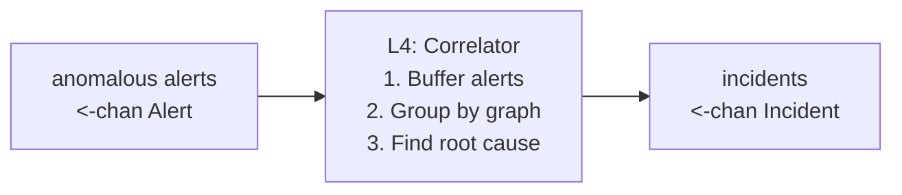
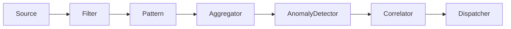
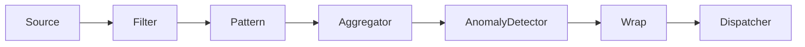

# Phase 4: Cross-Service Correlator — Design Document

**Layer:** L4 (Architecture diagram)  
**Date:** April 12, 2026  
**Status:** Draft  
**Depends on:** Phase 3 (Anomaly Detection)

---

## 1. Goal

Turn isolated per-service anomaly alerts into **incidents** by grouping
co-occurring anomalies from related services. Identify the suspected root
cause using the service dependency graph.

**Before (Phase 3):** Three separate alerts —  
"payment-service: connection refused (SPIKE)", "order-service: timeout
(SPIKE)", "notification-service: queue full (NEW)".

**After (Phase 4):** One incident —  
"payment-service is the suspected root cause (deepest in chain).
order-service and notification-service are cascading. Dependency chain:
order-service → payment-service."

> **Note on roadmap ordering:** The original DESIGN.md roadmap labeled
> Phase 4 as "LLM Diagnosis," combining L4 and L5. This document
> implements L4 (Correlator) as its own phase because it is a self-contained
> Go pipeline stage with no external dependencies, while L5 (LLM Diagnosis)
> requires API integration and RAG. L5 becomes Phase 5.

> **📎 Historical design record — Phase 4.** This document reflects the pipeline
> *as designed at this phase*. The current system runs **one pipeline per
> service** (fan-out) that fans in via `MergeAlerts` before this shared
> Correlator stage. See [DESIGN.md](DESIGN.md) § "Concurrency Model" for the
> current topology; the single-source pipeline diagrams below are point-in-time.

---

## 2. Architecture



The correlator is a **channel pipeline stage** that sits between the
AnomalyDetector and the Dispatcher, following the same pattern as every
other L2-L3 stage.

### Pipeline (with correlator enabled)



### Pipeline (correlator disabled)



Each Alert is wrapped in a single-alert Incident so the Dispatcher always
receives `Incident` objects regardless of configuration.

---

## 3. Data Types

### 3.1 Incident

The core output type. Lives in `internal/notify/` (alongside `Alert`) to
avoid a circular import between `correlator` → `notify` and `notify` →
`correlator`. The correlator package imports `notify` for both `Alert` and
`Incident`; the notify package never imports `correlator`.

```go
type Incident struct {
    ID          string         // deterministic hash of sorted service names + window
    Services    []string       // all affected services (sorted)
    RootService string         // suspected root cause (deepest in dep chain)
    DepChain    []string       // dependency path: root → ... → furthest affected
    Alerts      []Alert        // all correlated alerts in this incident
    OpenedAt    time.Time      // timestamp of earliest alert
    Window      time.Duration  // correlation window used
}
```

**ID generation:** `sha256(sorted_services + window_start_floor)[:12]`.
`window_start_floor = OpenedAt.Truncate(correlation_window)` — truncating
to the window boundary makes the ID deterministic regardless of alert
arrival order within the window. This supports future deduplication (L6).

### 3.2 DependencyGraph

Loaded from a static YAML config file. Represents directed "calls" edges.

```go
type DependencyGraph struct {
    edges map[string][]string // service → services it calls
}
```

**API:**

| Method | Signature | Purpose |
|---|---|---|
| `Calls` | `(svc) []string` | Direct downstream dependencies |
| `CalledBy` | `(svc) []string` | Direct upstream dependents |
| `Connected` | `(a, b) bool` | Same connected component (undirected) |
| `Component` | `(svc) int` | Component ID for grouping (O(1) lookup) |
| `Depth` | `(svc) int` | BFS distance from nearest root (0 = root/no callers) |
| `ShortestPath` | `(from, to) []string` | Shortest directed path, nil if unreachable |

**YAML format** (same as DESIGN.md):

```yaml
# config/dependencies.yaml
services:
  order-service:
    calls: [payment-service, inventory-service, notification-service]
  payment-service:
    calls: [bank-gateway, fraud-detection]
  inventory-service:
    calls: [warehouse-db]
  notification-service:
    calls: [email-provider, sms-provider]
```

---

## 4. Correlation Algorithm

### 4.1 Buffering

The correlator accumulates anomalous alerts for a configurable **correlation
window** (default: 2 minutes). This is a wall-clock timer, same as the
aggregator window.

```
time ──────────────────────────────────────────────────►
     │◄──── correlation window (2min) ────►│
     │                                      │
     │ alert A (svc-1)                      │
     │       alert B (svc-2)                │  ← same incident
     │              alert C (svc-3)         │
     │                                      │
     │                                 FLUSH│
```

On flush:
1. Collect all buffered alerts into a set.
2. Group into connected components using the dependency graph.
3. Emit one `Incident` per group.
4. Alerts from services not in the dependency graph → each becomes its own
   single-alert Incident (no correlation data).

### 4.2 Grouping

**Algorithm:** Pre-computed connected components + alert lookup.

At graph load time, compute the **undirected connected component** of each
service (treat all directed edges as undirected, then BFS/DFS). This is
O(V+E) once. Store a `component map[string]int` mapping each service to
its component ID.

At flush time:

```
For each alerting service S:
    group_id = graph.Component(S)   // O(1) lookup
    add alert to groups[group_id]

Services not in the graph → each gets its own unique group.
Each resulting group → one Incident.
```

This replaces the O(N² × (V+E)) pairwise `Connected` approach with O(N)
grouping. The `Connected(A, B)` method is still available for queries but
is no longer used in the hot path.

`Connected(A, B)` returns true if A and B are in the same connected
component (bidirectional reachability via undirected edges). This handles
the case where the root cause is deeper than the alerting service.

### 4.3 Root Cause Heuristic

Among all services in an incident group, the **root service** is the one
with the greatest `Depth()` in the dependency graph — i.e., the service
furthest from root-level entry points.

**Rationale:** Errors cascade *upstream*. If payment-service depends on
bank-gateway and both are erroring, bank-gateway is more likely the root
cause.

**Tie-breaking:** If multiple services share the same depth, pick the one
whose alert has the highest ZScore (strongest anomaly signal). For alerts
with multiple `PatternSummary` entries, use `max(ps.ZScore for ps in
alert.Patterns)` — the strongest anomaly signal within the alert.

### 4.4 Dependency Chain Construction

After selecting the root service, build the dependency chain by sorting
all affected services by depth (deepest first). This is simpler and more
robust than path computation, and handles fan-out topologies correctly.

```
DepChain = sort(affected_services, key=Depth, descending)
```

Example: `A → B → C`, all three alerting → `DepChain = ["C", "B", "A"]`.

For fan-out (`A → [B, C]`, all alerting, B and C at same depth):
`DepChain = ["B", "C", "A"]` (ties broken alphabetically).

Non-alerting intermediate services are **not** included in `DepChain` —
only services that actually produced alerts appear.

---

## 5. Pipeline Stage API

```go
// CorrelatorConfig controls correlation behavior.
type CorrelatorConfig struct {
    Window time.Duration // default: 2min; how long to buffer alerts
}

type Correlator struct {
    config CorrelatorConfig
    graph  *DependencyGraph
    Clock  notify.Clock
}

func NewCorrelator(cfg CorrelatorConfig, graph *DependencyGraph) *Correlator

// Run consumes anomalous alerts and emits correlated incidents.
// Flush happens on every Window tick or when the input channel closes.
func (c *Correlator) Run(ctx context.Context, in <-chan notify.Alert) <-chan Incident

// WrapAlerts is the bypass path when the correlator is disabled.
// Each alert becomes a single-alert Incident with no correlation metadata.
func WrapAlerts(ctx context.Context, in <-chan notify.Alert) <-chan Incident
```

### 5.1 Flush Triggers

| Trigger | Behavior |
|---|---|
| Window timer fires | Flush all buffered alerts, emit incidents |
| Input channel closes | Final flush of remaining buffer, close output |
| Context cancelled | Close output immediately |

This matches the Aggregator's flush model exactly.

---

## 6. Notification Changes

The Dispatcher and Notifiers currently operate on `notify.Alert`. Phase 4
changes them to operate on `notify.Incident` (the `Incident` type lives in
`notify` to avoid a circular import — see §3.1).

### 6.1 Dispatcher

```go
// Before (Phase 3):
func (d *Dispatcher) Dispatch(ctx context.Context, alert Alert) error

// After (Phase 4):
func (d *Dispatcher) Dispatch(ctx context.Context, incident Incident) error
```

### 6.2 Notifier Interface

```go
// Before (Phase 3):
type Notifier interface {
    Send(ctx context.Context, alert Alert) error
    Name() string
}

// After (Phase 4):
type Notifier interface {
    Send(ctx context.Context, incident Incident) error
    Name() string
}
```

### 6.3 Rendering Changes

**LogNotifier** — render incident header then each alert's patterns:

```
INCIDENT inc-a3f2 | root: bank-gateway | services: order-service, payment-service, bank-gateway
  chain: bank-gateway → payment-service → order-service
  [bank-gateway] 0 errors — service appears DOWN
  [payment-service] 200x ERROR connection refused to <*>:443 [SPIKE z=12.3]
  [order-service] 50x ERROR timeout calling payment-service <*> [SPIKE z=8.1]
```

**SlackNotifier** — incident header block + per-service pattern blocks:

```
🔴 INCIDENT inc-a3f2 — 3 services affected
Root cause: bank-gateway (deepest in chain)
Chain: bank-gateway → payment-service → order-service

[payment-service] ...pattern blocks...
[order-service] ...pattern blocks...
```

**Single-alert Incidents** (correlator disabled): Render identically to
the current Phase 3 format — the incident header is omitted when
`len(incident.Alerts) == 1 && incident.RootService == ""`.

---

## 7. Configuration

```yaml
# config/config.yaml additions
correlator:
  enabled: true
  window: 2m
  dependencies_file: config/dependencies.yaml
```

```go
// main.go additions
type CorrelatorConfig struct {
    Enabled          bool   `yaml:"enabled"`
    Window           string `yaml:"window"`
    DependenciesFile string `yaml:"dependencies_file"`
}
```

When `correlator.enabled: false`, the pipeline uses `WrapAlerts()` to
bypass correlation entirely. All existing behavior is preserved.

---

## 8. Package Structure

```
internal/notify/\n    incident.go        — Incident type + ID generation (avoids circular import)
internal/correlator/
    depgraph.go        — DependencyGraph (load YAML, Connected, Component, Depth, etc.)
    correlator.go      — Correlator pipeline stage + CorrelatorConfig
    wrap.go            — WrapAlerts bypass function
config/
    dependencies.yaml  — static service dependency graph
```

---

## 9. Edge Cases

| Scenario | Behavior |
|---|---|
| Single service alert, no graph edges | Emitted as single-alert Incident (no root cause) |
| Service not in dependency graph | Treated as isolated; own Incident with no dep chain |
| All alerts from one service | Single-service Incident; root = that service |
| Transitive dependency (A→B→C, A+C alert but not B) | A and C grouped (Connected via B); B listed in dep chain even though it didn't alert |
| Two disconnected groups alert simultaneously | Two separate Incidents emitted |
| No alerts in a window | No Incidents emitted (empty flush) |
| Circular dependency in graph | Connected returns true for all cycle members; Depth = BFS distance from nearest root (service with no callers). Standard `visited` set prevents re-visiting — O(V+E) |

---

## 10. What Phase 4 Does NOT Do

| Concern | Deferred to |
|---|---|
| LLM root-cause diagnosis | Phase 5 (L5) |
| Incident lifecycle (OPEN → ONGOING → RESOLVED) | Phase 5/6 |
| Deduplication across windows | Phase 6 |
| Auto-discovered dependency graph (from traces) | Future enhancement |
| SQLite persistence for incidents | Phase 5 |
| Severity assignment (P1/P2/P3) | Phase 5 (LLM assigns severity) |

---

## 11. Implementation Plan

1. **`internal/notify/incident.go`** — Incident struct + ID generation
   (lives in `notify` to avoid circular import).
2. **`internal/correlator/depgraph.go`** — Dependency graph loader + query
   methods (Connected, Component, Depth, ShortestPath).
3. **`internal/correlator/correlator.go`** — Pipeline stage with buffer +
   flush + component-based grouping + root cause selection.
4. **`internal/correlator/wrap.go`** — WrapAlerts bypass.
5. **Update `internal/notify/`** — Change Notifier interface to accept
   Incident. Update LogNotifier and SlackNotifier rendering.
6. **Update `cmd/agent/main.go`** — Add correlator wiring + config.
7. **Create `config/dependencies.yaml`** — Sample dependency graph.
8. **Update `testdata/sample_logs.ndjson`** — Multi-service fixture
   with dependent services alerting in the same window.
