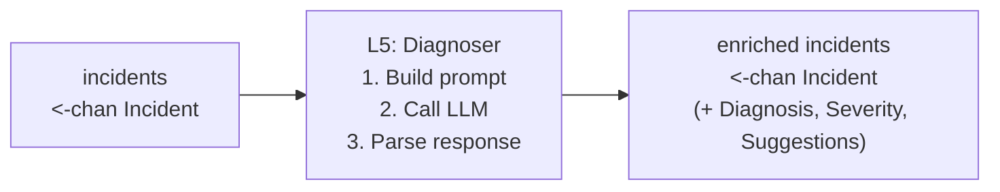
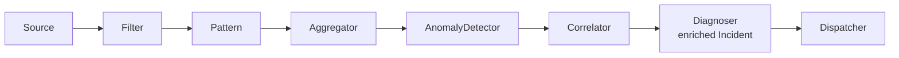
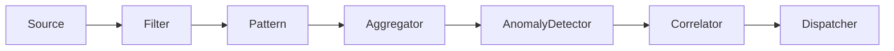

# Phase 5: LLM Diagnosis — Design Document

**Layer:** L5 (Architecture diagram)  
**Date:** April 12, 2026  
**Status:** Draft  
**Depends on:** Phase 4 (Cross-Service Correlator)

---

## 1. Goal

Enrich each `Incident` with a human-readable root-cause diagnosis,
severity assessment, and actionable fix suggestions — produced by an LLM.

**Before (Phase 4):** An incident says "bank-gateway is the suspected root
cause; payment-service and order-service are cascading."

**After (Phase 5):** The same incident also says:
> "bank-gateway v2.3.1 deployed 2 min before the incident is refusing
> connections on port 443. payment-service and order-service are timing out
> as a result. **Immediate action:** rollback bank-gateway to v2.3.0.
> **Severity:** P1 — customer-facing outage."

> **📎 Historical design record — Phase 5.** This document reflects the pipeline
> *as designed at this phase*. The current system runs **one pipeline per
> service** (fan-out) that fans in via `MergeAlerts` before the shared
> Correlator → Diagnoser stages. See [DESIGN.md](DESIGN.md) § "Concurrency
> Model" for the current topology; the diagrams below are point-in-time.

---

## 2. Architecture



The Diagnoser is a **channel pipeline stage** (same pattern as every other
layer) that sits between the Correlator output and the Dispatcher.

### Pipeline (with diagnoser enabled)



### Pipeline (diagnoser disabled)



When disabled, the Correlator output goes directly to the Dispatcher —
no wrapper needed because the `Incident` struct already has zero-value
diagnosis fields.

---

## 3. Data Types

### 3.1 Incident Extension

Add three fields to the existing `Incident` struct in `internal/notify/incident.go`:

```go
type Incident struct {
    // ... existing fields (ID, Services, RootService, DepChain, Alerts, OpenedAt, Window)

    Diagnosis   string   // LLM-generated root-cause explanation
    Severity    string   // P1, P2, P3 (assigned by LLM)
    Suggestions []string // actionable fix steps
}
```

These fields are zero-valued when the diagnoser is disabled, which
preserves backward compatibility with Phase 4 behavior — notifiers
already handle empty `Diagnosis`.

### 3.2 LLMClient Interface

An interface that abstracts the LLM provider. This allows testing with
a mock and swapping providers (DeepSeek, OpenAI, Anthropic) without
changing the Diagnoser.

```go
// Package diagnosis
type LLMClient interface {
    // Complete sends a prompt and returns the model's response text.
    // The implementation handles authentication, retries, and rate limits.
    Complete(ctx context.Context, prompt string) (string, error)
}
```

### 3.3 DiagnoserConfig

```go
type DiagnoserConfig struct {
    Endpoint    string        // LLM API endpoint (e.g. "https://api.deepseek.com/v1/chat/completions")
    Model       string        // model name (e.g. "deepseek-chat")
    MaxTokens   int           // max response tokens (default: 1024)
    Temperature float64       // 0.0 for deterministic diagnosis
    Timeout     time.Duration // per-call timeout (default: 30s)
}
```

---

## 4. Package Layout

```
internal/diagnosis/
    diagnoser.go    — pipeline stage: Run(ctx, in) <-chan Incident
    prompt.go       — prompt template + context assembly
    parse.go        — parse structured LLM output into fields
    llm.go          — LLMClient interface + HTTPClient implementation
```

The `diagnosis` package imports `notify` (for `Incident`, `Alert`,
`PatternSummary`). It does not import `correlator` — the correlator
produces `Incident`s that the diagnoser consumes via the channel.

---

## 5. Prompt Design

### 5.1 Template

The prompt is assembled from incident data. No external data sources
(deploys, RAG) in this phase — those are future enhancements.

```
You are an SRE assistant diagnosing a production incident.

INCIDENT CONTEXT:
- Time: {{.OpenedAt.Format "2006-01-02 15:04:05 UTC"}}
- Affected services: {{join .Services ", "}}
- Dependency chain: {{join .DepChain " → "}}
- Suspected root cause: {{.RootService}}

LOG PATTERNS (per service):
{{range .Alerts}}
[{{.Service}}] — {{.Count}} errors in {{.Window}} ({{.Level}})
{{range .Patterns}}  Pattern: "{{.Template}}" ({{.Count}}x) {{anomalyTag .}}
{{range .SampleLines}}    "{{.}}"
{{end}}{{end}}
{{end}}

Based on the above, respond in EXACTLY this format:

SEVERITY: P1 | P2 | P3
DIAGNOSIS: <one paragraph explaining the root cause>
SUGGESTIONS:
- <action 1>
- <action 2>
- <action 3>
```

### 5.2 Design Decisions

| Decision | Rationale |
|---|---|
| Structured output format | Regex parsing is simple and reliable; no JSON mode needed |
| Temperature = 0 | Deterministic output for the same incident |
| No streaming | Diagnosis is consumed programmatically, not displayed live |
| Anomaly tags in prompt | Gives the LLM signal about what's abnormal vs. baseline |
| Sample lines included | Concrete evidence; capped at 5 per pattern by L2 |
| No RAG / deploy context | Keep Phase 5 focused; add enrichment in a future phase |

### 5.3 Prompt Size Budget

| Component | Estimated tokens |
|---|---|
| System instructions + format spec | ~200 |
| Per-service section (3 services × 3 patterns × 5 samples) | ~600 |
| **Total prompt** | **~800** |
| Response (`max_tokens` ceiling) | 1024 |

For a typical 3-service incident, the prompt fits within context limits
with ample room. For larger incidents (10+ services), truncate to the
5 services with the highest max-ZScore, and append a note
"(N additional services omitted)" so the LLM knows context was trimmed.

---

## 6. Response Parsing

Parse the LLM response with simple line-prefix matching:

```go
func ParseDiagnosis(raw string) (severity, diagnosis string, suggestions []string)
```

1. Find line starting with `SEVERITY:` → extract `P1`, `P2`, or `P3`.
   Default to `P2` if missing or invalid.
2. Find line starting with `DIAGNOSIS:` → extract text until next section.
3. Find lines starting with `- ` after `SUGGESTIONS:` → collect into slice.

**Robustness:** If the LLM produces malformed output:
- Missing severity → default `P2`
- Missing diagnosis → use raw response as diagnosis
- Missing suggestions → empty slice
- Complete failure → diagnosis = "LLM diagnosis unavailable", severity = `P2`

No panics, no retries on parse failure. Log a warning and continue.

---

## 7. HTTP LLM Client

### 7.1 Implementation

```go
type HTTPClient struct {
    config DiagnoserConfig // Endpoint, Model, MaxTokens, Temperature, Timeout
    apiKey string          // from environment variable; never logged
    client *http.Client
}

func NewHTTPClient(cfg DiagnoserConfig, apiKey string) *HTTPClient
```

The endpoint, model, and generation parameters all come from
`DiagnoserConfig`. The only additional input is the API key (from an
environment variable, never from config files).

**OpenAI-compatible API:** DeepSeek, OpenAI, and most providers expose
the same `/v1/chat/completions` endpoint. The client sends a standard
`ChatCompletionRequest` and reads `ChatCompletionResponse`.

### 7.2 Error Handling

| Error | Behavior |
|---|---|
| Network timeout | Return error; Diagnoser logs warning, passes incident through unenriched |
| 429 (rate limit) | Retry once after `Retry-After` header (or 5s default), then fail |
| 500/503 (server error) | Retry once after 2s, then fail |
| 4xx (bad request) | Return error immediately, no retry |
| Malformed JSON response | Return error, log raw response body |

**Retry budget:** At most 1 retry per call. The agent processes ~5-20
incidents/day so aggressive retry is unnecessary.

### 7.3 Security

- API key loaded from environment variable (`LLM_API_KEY`), never
  from config file.
- API key is never logged.
- TLS required; no `InsecureSkipVerify`.
- Request body contains only log patterns and sample lines — no
  secrets or PII (log lines are pre-filtered by L1).

---

## 8. Diagnoser Pipeline Stage

```go
func (d *Diagnoser) Run(ctx context.Context, in <-chan notify.Incident) <-chan notify.Incident {
    out := make(chan notify.Incident, cap(in))
    go func() {
        defer close(out)
        for inc := range in {
            enriched := d.diagnose(ctx, inc)
            select {
            case out <- enriched:
            case <-ctx.Done():
                return
            }
        }
    }()
    return out
}
```

### 8.1 `diagnose()` Logic

1. Build prompt from incident data (`BuildPrompt(inc)`).
2. Call `LLMClient.Complete(ctx, prompt)`.
3. Parse response (`ParseDiagnosis(response)`).
4. Set `inc.Diagnosis`, `inc.Severity`, `inc.Suggestions`.
5. Return enriched incident.

**If LLM call fails:** Log a warning, set `inc.Diagnosis` to a fallback
message ("LLM diagnosis unavailable: <error>"), set `inc.Severity` to
the heuristic severity based on alert count, pass incident through.
The pipeline never blocks on LLM failure.

### 8.2 Heuristic Fallback Severity

When the LLM is unavailable, assign severity from alert data:

| Condition | Severity |
|---|---|
| ≥3 services affected OR any alert with Level=="FATAL" | P1 |
| 2 services affected OR total spike patterns across all alerts ≥5 | P2 |
| Otherwise | P3 |

Severity conditions are evaluated top-to-bottom; the first match wins.
"Spike patterns" = count of `PatternSummary` entries with
`Anomaly == AnomalySpike` summed across all `Alerts` in the incident.

### 8.3 Single-Alert Incidents

For incidents where `IsSingleAlert()` is true (from `WrapAlerts` bypass
or unknown-service isolation), still call the LLM — a single-service
anomaly may still benefit from diagnosis. The prompt adapts by omitting
the dependency chain and root cause sections.

**Cost guard:** When the correlator is disabled (all incidents come from
`WrapAlerts`), every anomaly triggers an LLM call. This is acceptable at
the expected volume (5-20 anomalies/day), but if volume is higher, the
diagnoser should be disabled via config rather than adding internal
throttling. The design deliberately keeps complexity out of the agent —
configuration controls which stages are active.

---

## 9. Notifier Updates

### 9.1 LogNotifier

When `inc.Diagnosis != ""`:

```
2026-04-12 14:35:00 INCIDENT id=abc123 root=bank-gw severity=P1
  DIAGNOSIS: bank-gateway v2.3.1 deployed 2 min ago is refusing connections...
  SUGGESTIONS:
    1. Rollback bank-gateway to v2.3.0
    2. Check bank-gateway deployment logs
  SERVICES: bank-gw, payment-svc, order-svc
  CHAIN: bank-gw → payment-svc → order-svc
  --- alerts follow ---
  [bank-gw] WARN  count=1  ...
```

### 9.2 SlackNotifier

Add a diagnosis section block after the header:

```
🔴 P1 INCIDENT — bank-gw → payment-svc → order-svc
Root cause: bank-gw

📋 Diagnosis:
  bank-gateway v2.3.1 deployed 2 min ago is refusing connections...

💡 Suggested actions:
  1. Rollback bank-gateway to v2.3.0
  2. Check bank-gateway deployment logs

[service-level alert blocks follow]
```

### 9.3 Single-Alert Incidents With Diagnosis

When a single-alert incident (`IsSingleAlert() == true`) has been
enriched by the diagnoser, `Diagnosis != ""` but `IsSingleAlert()`
is still true. Notifiers must handle this:

1. Render the alert in Phase 3 format (existing `sendAlert` path).
2. If `Diagnosis != ""`, **append** a diagnosis section below the alert.

This is additive — no change to `IsSingleAlert()` semantics. The
diagnosis section rendering is the same as for multi-service incidents;
it's just positioned after the single alert instead of between the
incident header and the alert list.

### 9.4 Backward Compatibility

When `Diagnosis == ""` (diagnoser disabled), notifiers render exactly
as in Phase 4. No change to existing output formatting.

---

## 10. Configuration

### 10.1 Config Struct

```yaml
diagnosis:
  enabled: true
  model: "deepseek-chat"
  endpoint: "https://api.deepseek.com/v1/chat/completions"
  max_tokens: 1024
  temperature: 0.0
  timeout: "30s"
  # API key from LLM_API_KEY environment variable
```

### 10.2 main.go Wiring

```go
// After correlator, before dispatcher:
var diagnosed <-chan notify.Incident
if cfg.Diagnosis.Enabled {
    apiKey := os.Getenv("LLM_API_KEY")
    if apiKey == "" {
        return fmt.Errorf("LLM_API_KEY must be set when diagnosis is enabled")
    }
    client := diagnosis.NewHTTPClient(diagCfg, apiKey)
    diagnoser := diagnosis.NewDiagnoser(diagCfg, client)
    diagnosed = diagnoser.Run(ctx, incidents)
    slog.Info("diagnoser enabled", "model", diagCfg.Model, "endpoint", diagCfg.Endpoint)
} else {
    diagnosed = incidents
}

for inc := range diagnosed {
    dispatcher.Dispatch(ctx, inc)
}
```

---

## 11. Testing Strategy

The LLM client is behind an interface, so all tests use a mock:

```go
type MockLLM struct {
    Response       string        // canned response to return
    Err            error         // error to return (nil for success)
    CapturedPrompt string        // last prompt received (for assertion)
    CallCount      int           // number of Complete calls
    Block          chan struct{} // if non-nil, Complete blocks until closed (for cancel tests)
}

func (m *MockLLM) Complete(ctx context.Context, prompt string) (string, error) {
    m.CallCount++
    m.CapturedPrompt = prompt
    if m.Block != nil {
        select {
        case <-m.Block:
        case <-ctx.Done():
            return "", ctx.Err()
        }
    }
    return m.Response, m.Err
}
```

**No real LLM calls in unit tests.** Integration tests with a real LLM
are manual and not part of CI.

Key test areas:
1. **Prompt assembly** — verify prompt contains expected sections
2. **Response parsing** — structured output, malformed output, edge cases
3. **Pipeline behavior** — channel close, context cancel, LLM failure fallback
4. **Notifier rendering** — diagnosis/severity/suggestions display
5. **HTTP client** — request format, error handling (via httptest)

See `PHASE5_TEST_PLAN.md` for detailed test cases.

---

## 12. Dependencies

| Dependency | Purpose | Notes |
|---|---|---|
| `net/http` (stdlib) | HTTP client for LLM API | No external libraries needed |
| `encoding/json` (stdlib) | Request/response serialization | OpenAI-compatible format |

**No new external dependencies.** The HTTP client uses stdlib only,
targeting the OpenAI-compatible chat completions API that DeepSeek and
most providers support.

---

## 13. What Phase 5 Does NOT Include

| Concern | Deferred to |
|---|---|
| RAG over past incidents | Future enhancement |
| Deploy context enrichment | Future enhancement |
| Incident lifecycle (OPEN/ONGOING/RESOLVED) | Phase 6 |
| Notification deduplication | Phase 6 |
| Streaming LLM responses | Not planned (programmatic consumer) |
| Multiple LLM providers / fallback chain | Future enhancement |
| Prompt caching / dedup for identical incidents | Phase 6 (tied to incident lifecycle) |

---

## 14. Cost & Performance

| Metric | Estimate |
|---|---|
| LLM calls per day | 5-20 (one per incident) |
| Avg prompt size | ~1000 tokens |
| Avg response size | ~200 tokens |
| Latency per call | 2-10s (network + generation) |
| Cost per call (DeepSeek) | ~$0.001 |
| Daily cost | < $0.02 |

The entire L1-L4 funnel ensures we only call the LLM for genuine,
correlated incidents — not for every log line or every window flush.
